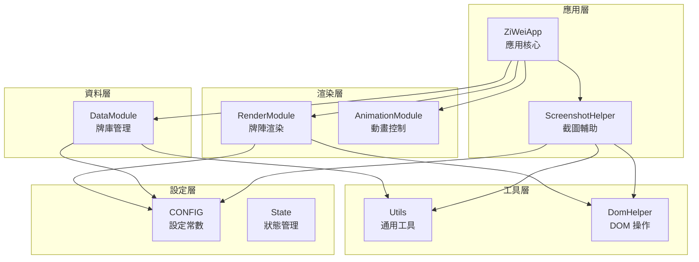

# ZiWeiCards 程式碼實作文檔

> 本文檔提供 ZiWeiCards 紫微牌卡應用程式的完整技術實作說明，包含架構設計、API 介面與實際範例。

---

## 1. 功能概述

### 1.1 應用程式功能

ZiWeiCards 是一款純前端的紫微牌卡線上抽牌應用程式，提供以下核心功能：

| 功能         | 描述                                           |
| ------------ | ---------------------------------------------- |
| **多種牌陣** | 支援 6 種牌陣類型與擲筊功能                    |
| **三類牌卡** | 主星牌 (78 張)、輔星牌 (38 張)、長生牌 (24 張) |
| **抽牌動畫** | 洗牌搖晃 + 翻牌動畫效果                        |
| **儲存牌面** | 將牌陣結果截圖儲存為 PNG 圖片                  |
| **擲筊占卜** | 聖杯/笑杯/蓋杯結果判定                         |

### 1.2 解決的技術問題

- **隨機性保證**：採用 Fisher-Yates 洗牌演算法確保公平隨機
- **不重複抽牌**：同一牌名不會同時出現正牌與倒牌
- **跨平台截圖**：處理 iOS Safari 的特殊下載行為
- **效能優化**：DOM 快取機制與部分洗牌策略

### 1.3 核心概念

| 術語              | 定義                                       |
| ----------------- | ------------------------------------------ |
| **牌陣 (Spread)** | 牌卡的排列方式，決定需抽取的牌卡數量與配置 |
| **主星牌**        | 紫微斗數中的 14 顆主星及其雙星組合         |
| **輔星牌**        | 四化、六吉星、六煞星等輔助星曜             |
| **長生牌**        | 長生十二神，代表生命週期的 12 個階段       |
| **正牌/倒牌**     | 每張牌卡的正向與逆向解讀狀態               |

---

## 2. API 介面文檔

### 2.1 CONFIG 設定物件

全域設定常數，儲存所有靜態設定值。

```javascript
const CONFIG = {
  MAIN_CARD_NAMES: string[],      // 主星牌名稱陣列 (39 種)
  SUPPORT_CARD_NAMES: string[],   // 輔星牌名稱陣列 (19 種)
  LIFE_CARD_NAMES: string[],      // 長生牌名稱陣列 (12 種)
  PALACE_NAMES: string[],         // 十二宮名稱
  SPREADS: {                      // 牌陣設定
    [key: string]: {
      name: string,               // 牌陣顯示名稱
      config: {                   // 牌陣配置
        main: number,             // 主星牌數量
        support: number,          // 輔星牌數量
        life: number,             // 長生牌數量
        extra: number             // 額外牌數量
      }
    }
  },
  BLOCKS: object,                 // 擲筊設定
  BRANCH_GRID_DATA: object[],     // 十二宮 Grid 對照表
  BACK_CARD: object,              // 背面牌設定
  COUNTER_API_URL: string,        // 統計 API URL
  ANIMATION: object,              // 動畫時間設定
  SCREENSHOT: object              // 截圖設定
}
```

---

### 2.2 Utils 工具函式模組

通用工具函式集合。

#### `Utils.shuffle(arr)`

使用 Fisher-Yates 演算法洗牌。

```javascript
/**
 * @param {Array<T>} arr - 待洗牌的陣列
 * @returns {Array<T>} 新的已洗牌陣列（不修改原陣列）
 */
const shuffled = Utils.shuffle([1, 2, 3, 4, 5]);
// 範例輸出: [3, 1, 5, 2, 4]
```

#### `Utils.formatDateTime(date)`

格式化日期時間為 `YYYY/MM/DD HH:mm:ss` 格式。

```javascript
/**
 * @param {Date} date - 日期物件
 * @returns {string} 格式化後的日期時間字串
 */
const formatted = Utils.formatDateTime(new Date());
// 範例輸出: "2025/12/11 08:30:00"
```

#### `Utils.randomInt(max)`

產生 0 到 max-1 之間的隨機整數。

```javascript
/**
 * @param {number} max - 上限值（不含）
 * @returns {number} 隨機整數
 */
const num = Utils.randomInt(10);
// 範例輸出: 7 (介於 0-9)
```

---

### 2.3 DomHelper DOM 操作輔助模組

具有快取機制的 DOM 操作輔助函式。

#### `DomHelper.get(id)`

取得 DOM 元素（含快取）。

```javascript
/**
 * @param {string} id - 元素 ID
 * @returns {HTMLElement|null} DOM 元素
 */
const btn = DomHelper.get('drawBtn');
```

#### `DomHelper.create(tag, className, text)`

建立新的 DOM 元素。

```javascript
/**
 * @param {string} tag - 標籤名稱
 * @param {string} [className=''] - CSS 類別
 * @param {string} [text=''] - 文字內容
 * @returns {HTMLElement} 新建立的元素
 */
const div = DomHelper.create('div', 'card', '牌卡');
```

#### `DomHelper.clearCache()`

清除 DOM 快取。

```javascript
DomHelper.clearCache();
```

---

### 2.4 DataModule 資料管理模組

負責牌庫初始化與抽牌邏輯。

#### `DataModule.initDecks()`

初始化所有牌庫。會在模組載入時自動執行。

```javascript
DataModule.initDecks();
// 結果: DataModule.decks = { main: [...], support: [...], life: [...] }
```

#### `DataModule.dealUnique(deck, count)`

抽取不重複牌卡。

```javascript
/**
 * @param {Array<{image: string, text: string}>} deck - 牌庫
 * @param {number} count - 抽取數量
 * @returns {Array<{image: string, text: string}>} 抽取的牌卡陣列
 */
const cards = DataModule.dealUnique(DataModule.decks.main, 3);
// 範例輸出:
// [
//   { image: "紫微.webp", text: "紫微-(正牌)" },
//   { image: "天機倒.webp", text: "天機-(倒牌)" },
//   { image: "太陽.webp", text: "太陽-(正牌)" }
// ]
```

> [!IMPORTANT]
> 此函式保證同一牌名不會同時出現正牌與倒牌。例如抽到「紫微-(正牌)」後，「紫微-(倒牌)」將被排除。

#### `DataModule.generatePalaceOrder()`

產生十二宮隨機順序。

```javascript
/**
 * @returns {string[]} 隨機排列的十二宮名稱陣列
 */
const order = DataModule.generatePalaceOrder();
// 範例輸出: ["僕", "遷", "疾", "財", "子", "夫", "兄", "命", "父", "福", "田", "官"]
```

---

### 2.5 RenderModule 渲染模組

負責將牌卡資料渲染為 DOM 元素。

#### `RenderModule.render(key, context)`

主要渲染入口。

```javascript
/**
 * @param {string} key - 牌陣類型的 key
 * @param {Object} context - 渲染上下文
 * @param {Object} context.data - 牌卡資料
 * @param {boolean} context.showBack - 是否顯示背面
 * @returns {HTMLElement} 渲染後的容器元素
 */
const container = RenderModule.render('basicThree', {
  data: {
    mains: [...],
    sups: [...],
    lifes: [...],
    spreadConfig: CONFIG.SPREADS.basicThree.config
  },
  showBack: false
});
```

#### 牌陣類型 Key 對照

| Key          | 牌陣名稱       | 渲染策略     |
| ------------ | -------------- | ------------ |
| `single`     | 一張牌陣       | `simple`     |
| `two`        | 二張牌陣       | `simple`     |
| `basicThree` | 三張基礎牌陣   | `simple`     |
| `opposition` | 對宮牌陣       | `opposition` |
| `threeFour`  | 三方四正牌陣   | `threeFour`  |
| `twelve`     | 十二宮位大牌陣 | `twelve`     |

---

### 2.6 AnimationModule 動畫模組

負責處理搖晃與翻牌動畫。

#### `AnimationModule.shake(container, callback)`

執行搖晃動畫（洗牌效果）。

```javascript
/**
 * @param {HTMLElement} container - 目標容器
 * @param {Function} [callback] - 動畫完成後的回呼
 */
AnimationModule.shake(container, () => {
  console.log('洗牌動畫完成');
});
```

#### `AnimationModule.flip(container, onHalfway, onComplete)`

執行翻牌動畫。

```javascript
/**
 * @param {HTMLElement} container - 目標容器
 * @param {Function} [onHalfway] - 動畫進行到一半時的回呼
 * @param {Function} [onComplete] - 動畫完成後的回呼
 */
AnimationModule.flip(
  container,
  () => RenderModule.render('basicThree', { data, showBack: false }),
  () => console.log('翻牌完成')
);
```

---

### 2.7 ZiWeiApp 應用程式核心

應用程式的主要入口點與事件處理器。

#### `ZiWeiApp.init()`

初始化應用程式。

```javascript
// 在 window.onload 時自動呼叫
ZiWeiApp.init();
```

#### `ZiWeiApp.triggerDraw(isBackside)`

觸發抽牌程序。

```javascript
/**
 * @param {boolean} [isBackside=false] - 是否顯示背面牌
 */
ZiWeiApp.triggerDraw(false); // 真正抽牌
ZiWeiApp.triggerDraw(true); // 預覽背面
```

#### `ZiWeiApp.handleShuffle()`

處理洗牌操作。

```javascript
ZiWeiApp.handleShuffle();
```

#### `ZiWeiApp.handleScreenshot()`

處理截圖儲存操作。

```javascript
ZiWeiApp.handleScreenshot();
```

---

### 2.8 ScreenshotHelper 截圖輔助模組

處理牌面截圖與下載。

#### `ScreenshotHelper.capture()`

執行截圖操作。

```javascript
ScreenshotHelper.capture();
```

> [!NOTE]
> 此函式內建防呆機制，連續點擊時會被阻擋，避免重複執行。

#### `ScreenshotHelper.getFilename(key, question)`

產生截圖檔案名稱。

```javascript
/**
 * @param {string} key - 牌陣類型 key
 * @param {string} question - 使用者輸入的問題
 * @returns {string} 檔案名稱
 */
const filename = ScreenshotHelper.getFilename('basicThree', '工作運勢');
// 範例輸出: "紫微牌卡_基礎牌陣_工作運勢_2025/12/11 08:30:00.png"
```

---

## 3. 架構設計

### 3.1 模組架構圖



### 3.2 設計決策

#### 為何使用原生 JavaScript 而非框架？

- **零依賴**：無需建構步驟，開啟 `index.html` 即可使用
- **輕量化**：無框架額外負擔，載入更快
- **簡單部署**：可直接部署至任何靜態主機

#### 為何採用模組化命名空間？

```javascript
// 使用物件作為命名空間，避免全域污染
const Utils = { shuffle, formatDateTime, randomInt };
const DataModule = { decks, initDecks, dealUnique };
```

- **避免全域污染**：所有函式封裝在物件內
- **清晰職責**：每個模組有明確的單一職責
- **易於測試**：可獨立測試各模組

#### 部分洗牌策略

```javascript
// 傳統方式：完整洗牌 O(n)
const shuffled = Utils.shuffle(deck);
const selected = shuffled.slice(0, count);

// 優化方式：部分洗牌 O(k)，只隨機選取所需數量
while (result.length < count && deckCopy.length > 0) {
  const i = Utils.randomInt(deckCopy.length);
  const card = deckCopy[i];
  // swap-and-pop 實現 O(1) 移除
  deckCopy[i] = deckCopy[deckCopy.length - 1];
  deckCopy.pop();
  // ...處理不重複邏輯
}
```

### 3.3 外部依賴

| 依賴             | 用途                      | 來源              |
| ---------------- | ------------------------- | ----------------- |
| **html2canvas**  | 牌面截圖功能              | CDN (含 SRI 驗證) |
| **Google Fonts** | 字型 (Noto Sans/Serif TC) | Google Fonts API  |

---

## 4. 實際範例

### 4.1 基礎抽牌流程

```javascript
// 1. 使用者選擇牌陣
const spreadKey = 'basicThree';

// 2. 取得牌陣設定
const spreadConfig = CONFIG.SPREADS[spreadKey].config;
// { main: 1, support: 1, life: 1, extra: 0 }

// 3. 抽取牌卡
const data = {
  spreadConfig,
  mains: DataModule.dealUnique(DataModule.decks.main, spreadConfig.main),
  sups: DataModule.dealUnique(DataModule.decks.support, spreadConfig.support),
  lifes: DataModule.dealUnique(DataModule.decks.life, spreadConfig.life),
};

// 4. 渲染背面並執行動畫
const container = RenderModule.render(spreadKey, { data, showBack: true });
AnimationModule.shake(container, () => {
  AnimationModule.flip(
    container,
    () => RenderModule.render(spreadKey, { data, showBack: false }),
    null
  );
});
```

### 4.2 十二宮位牌陣範例

```javascript
// 十二宮位需要額外的宮位名稱排列
const data = {
  spreadConfig: CONFIG.SPREADS.twelve.config,
  mains: DataModule.dealUnique(DataModule.decks.main, 13),
  sups: DataModule.dealUnique(DataModule.decks.support, 12),
  lifes: DataModule.dealUnique(DataModule.decks.life, 1),
  extra: DataModule.dealUnique(DataModule.decks.main, 1)[0],
  palaceNames: DataModule.generatePalaceOrder(),
};

RenderModule.render('twelve', { data, showBack: false });
```

### 4.3 自訂截圖樣式

```javascript
// ScreenshotHelper.styleClone 會自動套用截圖樣式
// 可透過修改此方法來自訂輸出樣式

ScreenshotHelper.styleClone = function (
  doc,
  containerId,
  title,
  question,
  time
) {
  const cloned = doc.getElementById(containerId);

  // 自訂背景色
  cloned.style.background = '#your-color';

  // 自訂 Header
  const header = doc.createElement('div');
  header.textContent = `自訂標題 - ${title}`;
  cloned.insertBefore(header, cloned.firstChild);

  // ... 其他樣式調整
};
```

### 4.4 錯誤處理範例

```javascript
// dealUnique 函式的防禦性程式設計
const cards = DataModule.dealUnique(null, 3);
// 回傳: [] (空陣列)

const cards2 = DataModule.dealUnique([], 3);
// 回傳: [] (空陣列)

const cards3 = DataModule.dealUnique(DataModule.decks.main, -1);
// 回傳: [] (空陣列)
```

---

## 5. 最佳實踐與常見陷阱

### ✅ 最佳實踐

1. **使用 DomHelper 快取**：頻繁存取的 DOM 元素應透過 `DomHelper.get()` 取得
2. **避免直接操作 innerHTML**：使用 `replaceChildren()` 減少重排
3. **防呆機制**：長時間操作（如截圖）應加入狀態鎖

### ⚠️ 常見陷阱

1. **忘記初始化牌庫**：`DataModule.initDecks()` 必須在抽牌前執行
2. **iOS 截圖相容性**：iOS Safari 對 Blob 支援不完整，需使用 Web Share API
3. **動畫時序**：翻牌動畫的 `onHalfway` 時機需精確配合 CSS 動畫時間

---

## 6. 品質檢查

- [x] 說明程式碼/功能的用途
- [x] 說明「為什麼」與目的
- [x] 定義關鍵概念
- [x] 包含函式簽名、參數與回傳值
- [x] 提供可執行的程式碼範例
- [x] 涵蓋錯誤處理與邊界情況
- [x] 說明架構與設計決策
- [x] 包含完整使用案例
- [x] 列出最佳實踐與常見陷阱
